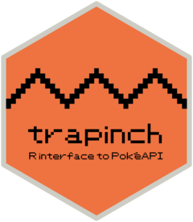

<!-- README.md is generated from README.Rmd. Please edit that file -->

```{r, include = FALSE}
knitr::opts_chunk$set(
  collapse = TRUE,
  comment = "#>",
  fig.path = "man/figures/README-",
  out.width = "100%"
)

library(httptest2)
start_vignette("readme")
```

# {trapinch} 

<!-- badges: start -->
[](https://www.repostatus.org/#wip)
[](https://github.com/matt-dray/trapinch/actions)
[](https://app.codecov.io/gh/matt-dray/trapinch?branch=main)
<!-- badges: end -->

A work-in-progress R package to interface with [the PokéAPI service](https://pokeapi.co/), based on [{httr2}](https://httr2.r-lib.org/).

Why 'Trapinch'? Because [it's a Pokémon](https://bulbapedia.bulbagarden.net/wiki/Trapinch_(Pok%C3%A9mon)) whose name contains 'R API' and it wasn't claimed on [Repokemon](https://cheeaun.github.io/repokemon/) yet, lol.

## Installation

You can install {trapinch} from GitHub with help from [{remotes}](https://remotes.r-lib.org/):

```{r install, eval=FALSE}
if (!require(remotes)) install.packages("remotes")
remotes::install_github("matt-dray/trapinch")
```

## Example

Functions are all prefaced `get_*()` and return a list. The generic request function is `get_pokeapi()`, to which you can provide an `endpoint` and `resource` of interest. Each endpoint also has its own function to which you need only supply the resource of interest, like `get_pokemon()` or `get_type()`.

For example, retrieve a named Pokémon's details:

```{r example-pokemon}
bulba <- trapinch::get_pokemon("bulbasaur")
bulba$moves[[1]]$move$name
```

Or retrieve an item's details:

```{r example-item}
ball <- trapinch::get_item("poke-ball")
ball$flavor_text_entries[[1]]$text
```

If you're wondering what endpoints and resources exist, you can find them in the `resource_lookups` list object. The endpoints:

```{r endpoints}
names(trapinch::resource_lookups)
```

And an example resource table for Pokémon types:

```{r resource}
head(trapinch::resource_lookups[["type"]])
```

See [the PokéAPI documentation](https://pokeapi.co/docs/v2) for full details of what can be returned.

# Similar projects

Wrappers in several languages are named on [the PokéAPI website](https://pokeapi.co/docs/v2#wrap). None of these are for R, although I'm aware of [{pokedex} from UBC-MDS](https://github.com/UBC-MDS/pokedex) (not on CRAN), which has a limited set of functions.

# Thanks

This package was made easier with help from the:

* [PokéAPI documentation](https://pokeapi.co/docs/v2)
* [{httr2} documentation](https://httr2.r-lib.org/index.html)
* [{httptest2} documentation](https://enpiar.com/httptest2/index.html)
* [HTTP Testing book](https://books.ropensci.org/http-testing/) from rOpenSci

```{r, include=FALSE}
end_vignette()
```
