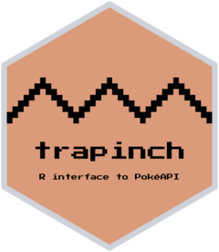

<!-- README.md is generated from README.Rmd. Please edit that file -->

# {trapinch} 

<!-- badges: start -->

[](https://www.repostatus.org/#wip)
[](https://github.com/matt-dray/trapinch/actions)
[](https://app.codecov.io/gh/matt-dray/trapinch?branch=main)
[](https://www.rostrum.blog/2023/02/02/trapinch/)
<!-- badges: end -->

A work-in-progress R package to interface with [the PokéAPI
service](https://pokeapi.co/), based on
[{httr2}](https://httr2.r-lib.org/).

Why ‘Trapinch’? Because [it’s a
Pokémon](https://bulbapedia.bulbagarden.net/wiki/Trapinch_(Pok%C3%A9mon))
whose name contains ‘R API’ and it wasn’t claimed on
[Repokemon](https://cheeaun.github.io/repokemon/) yet, lol.

## Installation

You can install {trapinch} from GitHub with help from
[{remotes}](https://remotes.r-lib.org/):

``` r
if (!require(remotes)) install.packages("remotes")
remotes::install_github("matt-dray/trapinch")
```

The package depends on R version 4.1 since it uses `R_user_dir()` and
the base pipe, `|>`.

## Example

Functions are all prefaced `get_*()` and return a list. The generic
request function is `get_pokeapi()`, to which you can provide an
`endpoint` and `resource` of interest. Each endpoint also has its own
function to which you need only supply the resource of interest, like
`get_pokemon()` or `get_type()`.

For example, retrieve a named Pokémon’s details:

``` r
bulba <- trapinch::get_pokemon("bulbasaur")
bulba$moves[[1]]$move$name
#> [1] "razor-wind"
```

Or retrieve an item’s details:

``` r
ball <- trapinch::get_item("poke-ball")
ball$flavor_text_entries[[1]]$text
#> [1] "A tool used for\ncatching wild\nPOKéMON."
```

If you’re wondering what endpoints and resources exist, you can find
them in the `resource_lookups` list object. The endpoints:

``` r
names(trapinch::resource_lookups)
#>  [1] "ability"                   "berry"                    
#>  [3] "berry-firmness"            "berry-flavor"             
#>  [5] "characteristic"            "contest-effect"           
#>  [7] "contest-type"              "egg-group"                
#>  [9] "encounter-condition"       "encounter-condition-value"
#> [11] "encounter-method"          "evolution-chain"          
#> [13] "evolution-trigger"         "gender"                   
#> [15] "generation"                "growth-rate"              
#> [17] "item"                      "item-attribute"           
#> [19] "item-category"             "item-fling-effect"        
#> [21] "item-pocket"               "language"                 
#> [23] "location"                  "location-area"            
#> [25] "machine"                   "move"                     
#> [27] "move-ailment"              "move-battle-style"        
#> [29] "move-category"             "move-damage-class"        
#> [31] "move-learn-method"         "move-target"              
#> [33] "nature"                    "pal-park-area"            
#> [35] "pokeathlon-stat"           "pokedex"                  
#> [37] "pokemon"                   "pokemon-color"            
#> [39] "pokemon-form"              "pokemon-habitat"          
#> [41] "pokemon-shape"             "pokemon-species"          
#> [43] "region"                    "stat"                     
#> [45] "super-contest-effect"      "type"                     
#> [47] "version"                   "version-group"
```

And an example resource table for Pokémon types:

``` r
head(trapinch::resource_lookups[["type"]])
#>   id     name                               url
#> 1  1   normal https://pokeapi.co/api/v2/type/1/
#> 2  2 fighting https://pokeapi.co/api/v2/type/2/
#> 3  3   flying https://pokeapi.co/api/v2/type/3/
#> 4  4   poison https://pokeapi.co/api/v2/type/4/
#> 5  5   ground https://pokeapi.co/api/v2/type/5/
#> 6  6     rock https://pokeapi.co/api/v2/type/6/
```

See [the PokéAPI documentation](https://pokeapi.co/docs/v2) for full
details of what can be returned.

# Similar projects

Wrappers in several languages are named on [the PokéAPI
website](https://pokeapi.co/docs/v2#wrap). None of these are for R,
although I’m aware of smaller-scale, more-focused code like [UBC-MDS’s
{pokedex}](https://github.com/UBC-MDS/pokedex) and [Eva Nguyen’s
{pokeWrapper}](https://nguyeneva.github.io/2020-02-06-rwrapper/).

# Thanks

This package was made easier with help from the:

- [PokéAPI documentation](https://pokeapi.co/docs/v2)
- [{httr2} documentation](https://httr2.r-lib.org/index.html)
- [{httptest2} documentation](https://enpiar.com/httptest2/index.html)
- [HTTP Testing book](https://books.ropensci.org/http-testing/) from
  rOpenSci
